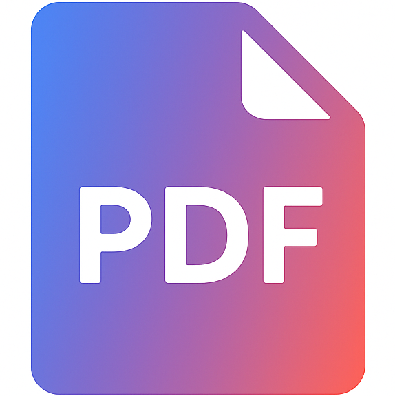

# PDF Viewer Android

<p align="center">
  
</p>

A simple, secure PDF viewer for Android designed specifically for environments where user input poses security risks, such as correctional facilities.

## Project Goals

This PDF viewer is designed with security and simplicity in mind:

- **No user input**: The app does not accept any user input, keyboard interactions, or text entry
- **Read-only PDF display**: Opens and displays PDF files without any editing capabilities
- **Secure by design**: Minimal attack surface for high-security environments
- **Simple interface**: Clean, straightforward PDF viewing with automatic page scaling

## Features

- **File picker interface**: Launch the app directly to browse and select PDF files from local storage
- **Intent-based opening**: Opens PDF files from file managers, email attachments, and other apps
- **Secure file browsing**: Uses Android's document picker with no file access history or persistence
- **Scrollable display**: Shows all pages in a scrollable view
- **Auto-scaling**: Automatically scales pages to fit screen width
- **Native rendering**: Uses Android's built-in PdfRenderer API for reliable PDF display
- **No network access**: Completely offline with no network permissions or external dependencies

## Build Instructions

### Prerequisites

- [Podman](https://podman.io/) (for containerized builds)
- OR Android SDK with API level 34 (for direct builds)

### Container Build (Recommended)

1. Clone the repository:
   ```bash
   git clone <repository-url>
   cd pdf-viewer-android
   ```

2. Run the build script:
   ```bash
   ./build.sh
   ```

   This will:
   - Build a containerized Android development environment
   - Compile both debug and release APKs
   - Output `ameelio-pdf-viewer.apk` (release) and `ameelio-pdf-viewer-debug.apk` (debug)

### Direct Build

If you have Android SDK installed:

```bash
./gradlew assembleDebug assembleRelease
```

### Testing

Run the comprehensive test suite to verify functionality and security:

```bash
# Run all tests
./gradlew check

# Run unit tests only
./gradlew test

# Run instrumentation tests (requires connected device/emulator)
./gradlew connectedAndroidTest

# Run security-focused tests
./gradlew testDebugUnitTest --tests="com.pdfviewer.SecurityTest"
```

#### Test Coverage

The test suite includes:

- **Unit Tests**: Activity lifecycle, security configuration, and state management
- **UI Tests**: File picker functionality, intent handling, and view interactions
- **Security Tests**: Data persistence prevention, no history tracking, and permission verification
- **Integration Tests**: PDF rendering, intent filters, and MIME type handling

## Installation

### Install on Device

1. Enable "Unknown Sources" in your Android device settings
2. Install the APK:
   ```bash
   adb install ameelio-pdf-viewer.apk
   ```

### Usage

#### Method 1: Direct Launch (File Picker)
1. Launch the "PDF Viewer" app from your app drawer
2. Tap "Select PDF File" to browse local storage
3. Choose a PDF file from the document picker
4. The PDF will display in a scrollable view
5. Use the back button to return to file selection or exit

#### Method 2: Open from Other Apps
1. Open any PDF file from your file manager, email, or other app
2. Select "PDF Viewer" when prompted to choose an app
3. The PDF will open and display all pages in a scrollable view
4. Use standard Android navigation (back button) to exit

## Technical Details

- **Target SDK**: Android 14 (API 34)
- **Minimum SDK**: Android 5.0 (API 21)
- **Permissions**: `READ_EXTERNAL_STORAGE` only
- **Architecture**: Single activity with native PDF rendering

## Security Considerations

This app is designed for high-security environments:

- **No user input persistence**: File selections and app state are never saved or cached
- **No history tracking**: No record of previously opened files or user interactions
- **No text input fields**: No keyboard interactions or text entry capabilities
- **No network access**: No internet permissions or external network dependencies
- **No backups**: Android backup functionality is disabled to prevent data persistence
- **Minimal permissions**: Only file reading access, no other system permissions
- **Read-only display**: PDF files are displayed without any editing capabilities
- **Secure file picker**: Uses Android's document picker with no access to file system history

## License

This project is licensed under the MIT License - see the [LICENSE](LICENSE) file for details.